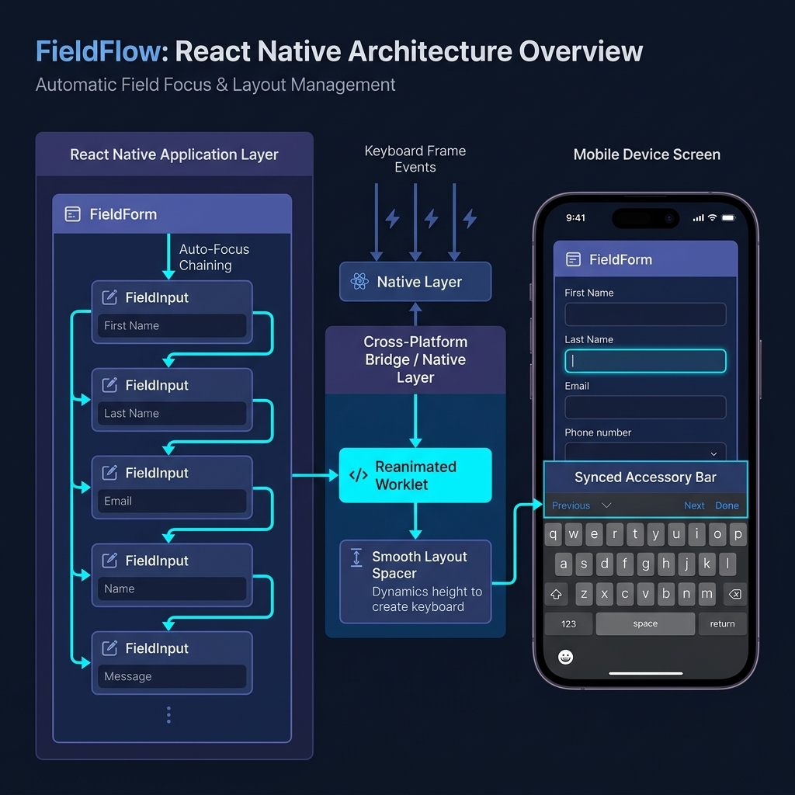

<div align="center">


<br/>
<br/>

**The ultimate keyboard management and form flow solution for React Native.**

<br/>

[](https://www.npmjs.com/package/react-native-fieldflow)
[](https://www.npmjs.com/package/react-native-fieldflow)
[](LICENSE)
[](https://reactnative.dev)
[](https://expo.dev)

<br/>

<table>
<tr>
<td align="center" width="33%">
<br/>
<sub><b>Smooth avoidance</b></sub><br/>
<sub>Animated spacer, no layout jumps</sub>
</td>
<td align="center" width="33%">
<br/>
<sub><b>Auto focus chain</b></sub><br/>
<sub>Next → Done, zero refs</sub>
</td>
<td align="center" width="33%">
<br/>
<sub><b>Platform parity</b></sub><br/>
<sub>Identical on iOS and Android</sub>
</td>
</tr>
</table>

**🚧 Coming Soon**

We’re working on adding **React Hook Form support** to make form handling, validation, and integration even smoother.

Stay tuned!

</div>

---

## Why this exists

Every React Native project with a form hits the same wall.

You need `KeyboardAvoidingView`. You need different `behavior` props per platform. You need `keyboardVerticalOffset` that works with your specific header height. You need `blurOnSubmit={false}` to stop the keyboard flashing between fields. You need a `ref` per input. You need to wire `onSubmitEditing` on every field to focus the next one. You need the last field to call submit. You need a `ScrollView` with `keyboardShouldPersistTaps="handled"`.

That's the minimum — on a simple login screen. Scale to 8 fields and this is 60 lines of boilerplate you write identically in every project.

FieldFlow replaces all of it with two components.

---

## Install

```sh
npm install react-native-fieldflow
```

> Zero native modules · No `pod install` · Expo compatible · React Native ≥ 0.68

---

## The entire API, right here

```tsx
import { FieldForm, FieldInput } from 'react-native-fieldflow';

export default function SignUpScreen() {
  return (
    <FieldForm onSubmit={handleSubmit}>
      <FieldInput placeholder="Full name"        textContentType="name" />
      <FieldInput placeholder="Email"            textContentType="emailAddress" keyboardType="email-address" autoCapitalize="none" />
      <FieldInput placeholder="Phone"            textContentType="telephoneNumber" keyboardType="phone-pad" />
      <FieldInput placeholder="Password"         textContentType="newPassword" secureTextEntry />
      <FieldInput placeholder="Confirm password" textContentType="newPassword" secureTextEntry />
    </FieldForm>
  );
}
```

That's a fully working, properly keyboard-avoiding, auto-chaining 5-field sign-up form.

- Field 1–4 get `returnKeyType="next"` automatically
- Field 5 gets `returnKeyType="done"` automatically
- Tapping Next on any field scrolls and focuses the next one
- Tapping Done on the last field calls `handleSubmit` and dismisses the keyboard
- The layout never jumps — an internal `Animated.Value` spacer tracks the keyboard frame natively
- Behavior is identical on iOS and Android

---

## Before and after

The same screen, the old way:

```tsx
// ❌ Every form you've ever written
const nameRef    = useRef<TextInput>(null);
const emailRef   = useRef<TextInput>(null);
const phoneRef   = useRef<TextInput>(null);
const passRef    = useRef<TextInput>(null);
const confirmRef = useRef<TextInput>(null);

<KeyboardAvoidingView
  behavior={Platform.OS === 'ios' ? 'padding' : 'height'}
  keyboardVerticalOffset={Platform.OS === 'ios' ? 64 : 0}
  style={{ flex: 1 }}
>
  <ScrollView
    keyboardShouldPersistTaps="handled"
    contentContainerStyle={{ flexGrow: 1 }}
  >
    <TextInput ref={nameRef}    returnKeyType="next" blurOnSubmit={false} onSubmitEditing={() => emailRef.current?.focus()} />
    <TextInput ref={emailRef}   returnKeyType="next" blurOnSubmit={false} onSubmitEditing={() => phoneRef.current?.focus()} />
    <TextInput ref={phoneRef}   returnKeyType="next" blurOnSubmit={false} onSubmitEditing={() => passRef.current?.focus()} />
    <TextInput ref={passRef}    returnKeyType="next" blurOnSubmit={false} onSubmitEditing={() => confirmRef.current?.focus()} />
    <TextInput ref={confirmRef} returnKeyType="done" onSubmitEditing={handleSubmit} />
  </ScrollView>
</KeyboardAvoidingView>
```

With FieldFlow:

```tsx
// ✅ Every form from now on
<FieldForm onSubmit={handleSubmit}>
  <FieldInput placeholder="Full name" />
  <FieldInput placeholder="Email"     keyboardType="email-address" autoCapitalize="none" />
  <FieldInput placeholder="Phone"     keyboardType="phone-pad" />
  <FieldInput placeholder="Password"  secureTextEntry />
  <FieldInput placeholder="Confirm"   secureTextEntry />
</FieldForm>
```

---

## How it works

<div align="center">

</div>

<br/>

`FieldForm` subscribes to native keyboard frame events. As the keyboard animates in, an internal `Animated.View` spacer at the bottom of the scroll content grows to match — pushing content up in sync with the keyboard, with no layout recalculation and no white flash.

At the same time, every `FieldInput` registers itself into an ordered focus chain. When you tap Next, FieldFlow calls `focus()` on the next ref and runs `scrollResponderScrollNativeHandleToKeyboard` to ensure the newly focused field is visible above the keyboard — even accounting for `extraScrollPadding` so it doesn't sit flush against it.

Nothing about this requires native modules. It is entirely JS-side and works on Expo, bare RN, and the New Architecture.

---

## API

### `<FieldForm>`

| Prop | Type | Default | Description |
|------|------|---------|-------------|
| `onSubmit` | `() => void` | — | Called when the last field is submitted |
| `extraScrollPadding` | `number` | `100` | Space between the active field and the keyboard top edge |
| `scrollable` | `boolean` | `true` | Wrap children in a managed ScrollView |
| `avoidKeyboard` | `boolean` | `true` | Enable the animated keyboard spacer |
| `style` | `ViewStyle` | — | Container style |
| `scrollViewProps` | `ScrollViewProps` | — | Forwarded to the internal ScrollView |
| `onKeyboardShow` | `(height: number) => void` | — | Called when keyboard appears |
| `onKeyboardHide` | `() => void` | — | Called when keyboard dismisses |

### `<FieldInput>`

Accepts every `TextInput` prop, plus:

| Prop | Type | Default | Description |
|------|------|---------|-------------|
| `shouldIgnoreChain` | `boolean` | `false` | Exclude this field from the focus chain |
| `nextRef` | `RefObject<TextInput>` | — | Override: focus this ref instead of the auto-detected next field |
| `onFormSubmit` | `() => void` | — | Override: called when this field is the last and Done is tapped |

### Hooks

```tsx
import { useKeyboardHeight, useKeyboardVisible } from 'react-native-fieldflow';

const height  = useKeyboardHeight();   // number — 0 when hidden
const visible = useKeyboardVisible();  // boolean
```

Both hooks use `keyboardWillShow` / `keyboardWillHide` on iOS (smooth, frame-synchronised) and `keyboardDidShow` / `keyboardDidHide` on Android. No polling, no timers.

**Example — button that lifts above the keyboard:**

```tsx
function SubmitButton() {
  const height = useKeyboardHeight();

  return (
    <Animated.View style={{ marginBottom: height }}>
      <TouchableOpacity onPress={handleSubmit}>
        <Text>Continue</Text>
      </TouchableOpacity>
    </Animated.View>
  );
}
```

---

## Comparison

|  | `KeyboardAvoidingView` | `keyboard-aware-scroll-view` | **FieldFlow** |
|--|--|--|--|
| No layout jumps | ❌ | ⚠️ Sometimes | ✅ |
| Identical iOS + Android | ❌ | ⚠️ | ✅ |
| Auto Next / Done | ❌ Manual | ❌ Manual | ✅ |
| Ref management | ❌ Manual | ❌ Manual | ✅ None |
| Works with Expo | ✅ | ✅ | ✅ |
| New Architecture | ✅ | ⚠️ | ✅ |
| Native modules | None | None | None |

---

## Common questions

<details>
<summary><b>Does it work with React Navigation?</b></summary>
<br/>

Yes. FieldFlow measures available window height rather than screen height, so it accounts for headers, tab bars, and any custom chrome automatically. No `keyboardVerticalOffset` guessing required.
</details>

<details>
<summary><b>What if I have a custom Input component?</b></summary>
<br/>

As long as your component forwards its ref with `forwardRef` and renders a `FieldInput` internally, it is picked up by the chain automatically. Nothing special needed.

```tsx
const MyInput = forwardRef<TextInput, MyInputProps>((props, ref) => (
  <View>
    <Text>{props.label}</Text>
    <FieldInput ref={ref} {...props} />
  </View>
));
```
</details>

<details>
<summary><b>Can I skip a field in the chain?</b></summary>
<br/>

Yes. Add `shouldIgnoreChain` to any `FieldInput` and the focus chain skips over it as if it doesn't exist. The field is still fully functional — it just doesn't participate in Next/Done handling.
</details>

<details>
<summary><b>Can I manually control which field comes next?</b></summary>
<br/>

Yes. Pass a `nextRef` to any `FieldInput` to override the auto-detected next field. Useful when your field order doesn't match the visual layout.

```tsx
const notesRef = useRef<TextInput>(null);

<FieldInput placeholder="Email" nextRef={notesRef} />
<FieldInput placeholder="Phone" />                    {/* skipped */}
<FieldInput placeholder="Notes" ref={notesRef} />
```
</details>

<details>
<summary><b>Does it support the New Architecture (Fabric)?</b></summary>
<br/>

Yes. FieldFlow uses `Animated`, `Keyboard`, and standard event listeners — all of which are fully supported on both architectures.
</details>

---

## Contributing

Bug reports, feature requests, and pull requests are all welcome.

If you find an edge case — a device, a navigation setup, a keyboard type that breaks the chain — please open an issue with a minimal reproduction. That's the most valuable contribution you can make.

- [Contributing guide](CONTRIBUTING.md)
- [Bug report](.github/ISSUE_TEMPLATE/bug_report.yml)
- [Feature request](.github/ISSUE_TEMPLATE/feature_request.yml)

---

<div align="center">

If FieldFlow saves you time, a star helps other developers find it.

**[⭐ Star on GitHub](https://github.com/SyedSohaib456/react-native-fieldflow)**

<br/>

MIT © [Syed Sohaib](https://github.com/SyedSohaib456)

</div>
